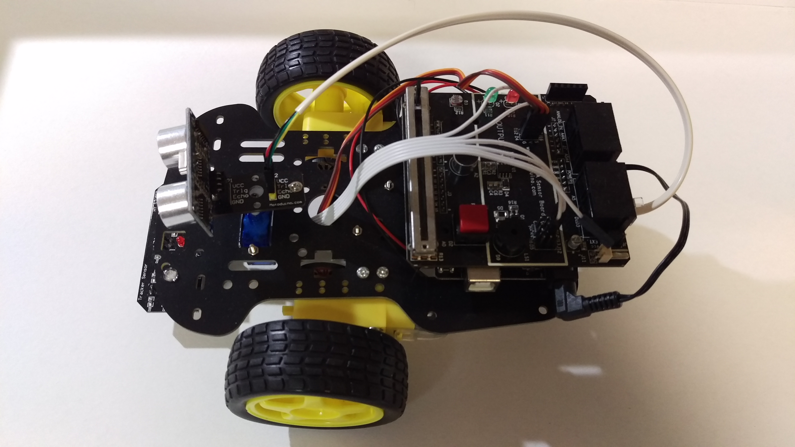

# Cars.IO

Make an avoidance, patrolling line and bluetooth controlling car on the arduino-based platform. We use motoduino (extended from arduino) made by `motoduino lab Inc.` 

## Architecture

* Motoduino U1 : The motoduino is the motor-controlling board. 
* S4A Sensor Board
* Line Tracker Module (3 Channels, LE 95) : Infrared patrolling line sensors
* HC-SR04 : ultrasonic Sensor  
* SG90 Serve Motor
* Bluetooth HC05
* 9V Battery

## Content

* Avoidance
* Patrolling line
* Bluetooth

## Implement

Here is the car we created to do avoidance, patrolling line and bluetooth controlling events.

